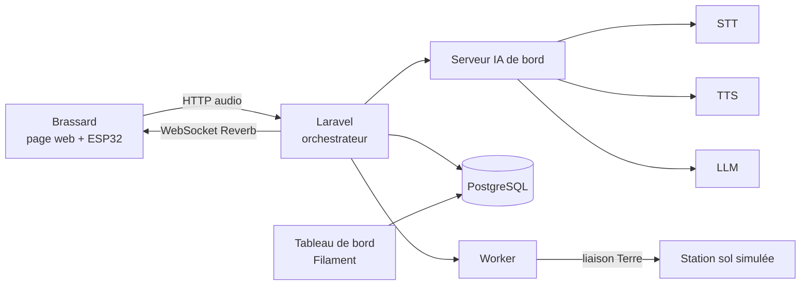

# DUMONT — L'IA d'équipage qui survit à la coupure Terre

> État du dépôt : le logiciel disponible est le runtime Python Jarvis Office,
> sa PWA et son intercom. L'architecture Laravel/Docker, le mode Ollama et les
> contrats du projet de concours ci-dessous décrivent une cible à construire.
> Ils ne sont pas encore livrés. Les commandes utilisables figurent en section 4.

> Workshop national EPSI 2026 · Bachelor 3 · **Pilier 4 — DeepTech & Secure Systems**
> Équipe : **Elias · Aymen · Evan · Faiz · Alexandre**

Dumont est l'assistant vocal de bord, porté au poignet de l'équipage. Il prend les notes, relaie les messages vers la Terre et répond aux questions de l'équipage. Surtout, il continue de fonctionner quand la liaison Terre tombe, quand un service plante, ou quand un appareil du réseau devient hostile.

---

## Sommaire

1. [Réponse au sujet](#1-réponse-au-sujet)
2. [La démo](#2-la-démo)
3. [Architecture](#3-architecture)
4. [Démarrer le projet](#4-démarrer-le-projet)
5. [Contrats figés](#5-contrats-figés)
6. [Équipe et périmètres](#6-équipe-et-périmètres)
7. [Tâches par personne](#7-tâches-par-personne)
8. [Planning de la semaine](#8-planning-de-la-semaine)
9. [Règles de développement](#9-règles-de-développement)
10. [Décisions d'architecture (ADR)](#10-décisions-darchitecture-adr)
11. [Rendus du jeudi soir](#11-rendus-du-jeudi-soir)
12. [Soutenance](#12-soutenance)
13. [Grille d'évaluation → preuves](#13-grille-dévaluation--preuves)
14. [Risques et plans B](#14-risques-et-plans-b)
15. [Arborescence](#15-arborescence)

---

## 1. Réponse au sujet

Le pilier 4 demande la colonne vertébrale numérique du vaisseau : calcul local, IA décisionnelle, communication asynchrone, sécurité. Dumont couvre les trois pistes du sujet dans un seul produit.

| Exigence du sujet | Ce que fait Dumont |
| --- | --- |
| **A. OfflineSpace** — continuer localement, stocker, prioriser, resynchroniser | Bascule automatique en mode autonome : LLM de bord, file d'envoi vers la Terre classée par priorité, synchronisation automatique au retour de la liaison |
| **B. CyberSpace** — détecter un comportement anormal, isoler l'appareil | Chaque brassard est authentifié ; un appareil au comportement anormal est isolé automatiquement et signalé au tableau de bord |
| **C. EdgeAI** — analyser sans Internet | Transcription, synthèse vocale et LLM de secours tournent sur le serveur IA de bord |
| **Crise** — rupture du lien Terre pendant 24 h | Scénario central de la démo : coupure, fonctionnement autonome, retour et resynchronisation sans intervention humaine |
| **Interconnexion** entre équipes du vaisseau | API ouverte : les autres projets (MedBox, SpaceGrid, SpaceFarm…) poussent leurs alertes, Dumont les annonce à l'équipage et les relaie vers la Terre |

---

## 2. La démo

Quatre actes, environ trois minutes, joués en direct pendant les minutes 2 à 5 de la soutenance.

| Acte | Action | Ce que voit le jury | Piste |
| --- | --- | --- | --- |
| 1. Nominal | Evan : « Dumont, note : pression anormale sur la pompe 2, préviens la Terre. » | Transcription à l'écran, réponse vocale, note créée, message reçu par la station sol | EdgeAI |
| 2. Coupure Terre | Faiz déclenche la crise depuis le tableau de bord | Bandeau **MODE AUTONOME** sur le brassard ; Dumont répond encore avec le LLM de bord ; les messages vers la Terre s'empilent par priorité | OfflineSpace |
| 3. Intrusion | Alexandre lance `make attack` | Un brassard compromis inonde l'API, il est isolé en quelques secondes ; alerte au tableau de bord, vibration sur le brassard d'Evan | CyberSpace |
| 4. Retour liaison | Faiz rétablit la liaison | La file se vide dans l'ordre des priorités, la station sol affiche les messages reçus | OfflineSpace |

La même séquence, filmée, sert de vidéo chrono (rendu obligatoire) et de démonstration pour la finale nationale, où la démo live est interdite.

---

## 3. Architecture



**Le serveur IA de bord** expose trois capacités — transcription, synthèse vocale, LLM — derrière un seul contrat HTTP. Il reprend [jarvis-voice](https://github.com/AVTAVANTTOUT2/jarvis-voice) pour la voix. Le LLM est choisi par nom de modèle :

- `deepseek-chat` — l'IA « côté Terre », utilisée quand la liaison est active. Dans le prototype, la route est relayée vers l'API DeepSeek (compatible OpenAI).
- `local` — le modèle de bord, servi par Ollama, qui prend le relais en mode autonome.

C'est Laravel qui choisit le modèle selon l'état de la liaison Terre. Le reste du code ne sait pas lequel tourne.

### Stack

| Couche | Techno |
| --- | --- |
| Web, API, orchestrateur | PHP 8.3, Laravel 12 |
| Temps réel | Laravel Reverb (WebSocket) |
| Tableau de bord | Filament 4 |
| Base de données | PostgreSQL 16 |
| File de jobs, cache | Redis 7 |
| Serveur IA | Python, FastAPI, jarvis-voice (faster-whisper large-v3-turbo, Qwen3-TTS), Ollama |
| LLM | DeepSeek `deepseek-chat` + modèle local Ollama |
| Brassard | Page Blade plein écran sur téléphone sanglé au poignet ; ESP32 (bouton, vibreur, LED) en bonus |
| Déploiement | Docker Compose |

---

## 4. Démarrer le projet

### Code disponible : Jarvis Office

Pour préparer et vérifier le checkout de développement : Python 3.12, `uv` et
Node.js 22 ou supérieur sont nécessaires. Aucun modèle ni secret n'est inclus.

```bash
uv sync --locked --extra private --no-python-downloads
./scripts/verify.sh
```

Le service utilise une wheel installée dans une release, des environnements
créés à leur emplacement final et des actifs privés importés et vérifiés.
Une première installation doit préparer ces éléments puis activer `current`.
Après installation, son état et son redémarrage se contrôlent ainsi :

```bash
office_root="$HOME/Library/Application Support/JarvisOffice"
"$office_root/current/main/bin/python" -I -B -m jarvis_office service status --config "$office_root/config.toml" --json
"$office_root/current/main/bin/python" -I -B -m jarvis_office service restart --config "$office_root/config.toml" --json
```

Le service démarre en pause. Le navigateur choisit un profil avant d'ouvrir
une conversation ou un appel équipage. État et limites : [PROJECT_STATE.md](PROJECT_STATE.md).
Pour conserver un frontal HTTPS Tailscale existant après relance du service,
renseigner son seul nom d'hôte dans `voice.public_host` du TOML privé. Le serveur
reste en écoute locale ; ce réglage ne crée ni tunnel ni certificat.

### Pile cible : commandes prévues, pas encore disponibles

Les exemples suivants sont le plan de la future pile Laravel/Docker. Le
`Makefile`, `compose.yaml` et `ai-server/` n'existent pas encore dans ce dépôt.
Ne pas les utiliser pour relancer l'installation Python actuelle.

Prérequis prévus pour cette cible : Docker, Git, Make.

```bash
git clone <url-du-depot> dumont && cd dumont
cp .env.example .env          # renseigner AI_SERVER_URL
make up                       # web, reverb, worker, postgres, redis
make seed                     # brassards et données de démo
```

Sur la machine du serveur IA (Mac Apple Silicon, à cause du TTS) :

```bash
cd ai-server
cp .env.example .env          # DEEPSEEK_API_KEY, OLLAMA_MODEL
make ai                       # lance /v1/stt, /v1/tts, /v1/chat/completions
```

| Commande | Effet |
| --- | --- |
| `make up` / `make down` | Démarre, arrête la pile |
| `make seed` | Crée trois brassards et des données de démo |
| `make crisis` | Coupe la liaison Terre |
| `make restore` | Rétablit la liaison Terre |
| `make attack` | Simule un brassard compromis |
| `make demo` | Remet tout à zéro avant une démo |

Adresses en local : brassard `http://localhost:8000/band`, tableau de bord `http://localhost:8000/admin`, station sol `http://localhost:8000/ground`.

---

## 5. Contrats figés

Ces contrats sont écrits le lundi et ne changent plus. Ils permettent aux cinq de travailler en parallèle dès le mardi, chacun contre une version simulée des autres. Une modification passe par une PR étiquetée `contract` et l'accord des cinq.

### 5.1 Serveur IA — `AI_SERVER_URL`

| Route | Entrée | Sortie |
| --- | --- | --- |
| `POST /v1/stt` | Audio multipart (WAV ou WebM), `language=fr` | `{ "text": "...", "duration_ms": 840 }` |
| `POST /v1/tts` | `{ "text": "..." }` | `audio/wav` |
| `POST /v1/chat/completions` | Format OpenAI, `model: deepseek-chat \| local`, `stream: true` | Flux SSE au format OpenAI |
| `GET /v1/health` | — | `{ "stt": "ok", "tts": "ok", "llm": { "deepseek-chat": "ok", "local": "ok" } }` |

### 5.2 API Laravel — préfixe `/api`

| Méthode | Route | Rôle | Propriétaire |
| --- | --- | --- | --- |
| `POST` | `/turns` | Envoie un tour de parole (audio ou texte), rend `{ turn_id }` ; la réponse arrive par WebSocket | Aymen |
| `GET` | `/ship/status` | Liaison Terre, file d'envoi, santé du serveur IA, appareils isolés | Faiz |
| `POST` | `/ship/events` | Point d'entrée des autres équipes : `{ source, level, message }` | Aymen |
| `POST` | `/link` | `{ "state": "up" \| "down" }` — bascule de la liaison Terre | Faiz |
| `POST` | `/ground/receive` | Station sol simulée, reçoit les messages synchronisés | Faiz |

Authentification : jeton d'appareil (Laravel Sanctum) en en-tête `Authorization: Bearer`.

### 5.3 WebSocket — Reverb

Canaux : `band.{deviceId}` (privé, un par brassard) et `ship` (diffusion à tous).

| Événement | Canal | Charge utile |
| --- | --- | --- |
| `turn.transcript` | `band.{id}` | `{ turn_id, text }` |
| `turn.delta` | `band.{id}` | `{ turn_id, text }` — fragment de réponse |
| `turn.audio` | `band.{id}` | `{ turn_id, url }` — WAV d'une phrase, à jouer dans l'ordre |
| `turn.done` | `band.{id}` | `{ turn_id, model, latency_ms }` |
| `link.changed` | `ship` | `{ state: "up" \| "down" }` |
| `outbox.updated` | `ship` | `{ pending, sent }` |
| `security.alert` | `ship` | `{ device_id, rule, level }` |
| `device.isolated` | `band.{id}` + `ship` | `{ device_id, reason }` |
| `ship.event` | `ship` | `{ source, level, message }` — alerte d'une autre équipe |

### 5.4 Tables

| Table | Contenu | Propriétaire |
| --- | --- | --- |
| `devices` | Brassards : nom, jeton, statut `active \| isolated`, dernier contact | Alexandre |
| `turns` | Tour de parole : transcript, réponse, modèle utilisé, mode, latences | Aymen |
| `notes` | Notes dictées : type `observation \| action \| anomalie`, auteur | Aymen |
| `outbox` | Messages vers la Terre : priorité `critique \| haute \| normale \| basse`, statut `queued \| sent` | Faiz |
| `link_events` | Historique des coupures et rétablissements | Faiz |
| `ship_events` | Alertes reçues des autres équipes | Aymen |
| `security_events` | Journal de sécurité, en ajout seul | Alexandre |

---

## 6. Équipe et périmètres

Chaque dossier a un seul propriétaire. On relit le code des autres, on ne le modifie pas sans leur accord.

| Qui | Rôle | Possède | Relit |
| --- | --- | --- | --- |
| **Elias** | Serveur IA, infra, lead technique | `ai-server/`, `compose.yaml`, `Makefile` | Toutes les PR qui touchent un contrat |
| **Aymen** | Orchestrateur IA | `app/Orchestrator/`, `app/Tools/`, `app/Http/Controllers/TurnController.php` | Evan |
| **Evan** | Brassard, front et IoT | `resources/views/band/`, `resources/js/band/`, `firmware/` | Aymen |
| **Faiz** | OfflineSpace et données | `database/`, `app/Offline/`, `app/Filament/` (hors sécurité) | Alexandre |
| **Alexandre** | CyberSpace, pilotage projet, livrables | `app/Security/`, `scripts/`, `docs/` | Faiz |

---

## 7. Tâches par personne

Cocher au fil de l'eau. Une tâche est finie quand elle est fusionnée dans `main` **et** visible sur le brassard ou le tableau de bord.

### Elias — Serveur IA, infra, lead technique

**J1 — lundi**
- [ ] Créer le dépôt GitHub, protéger `main`, ajouter les cinq, créer `CODEOWNERS`
- [ ] Écrire la section 5 (contrats) et la faire valider par les cinq avant 17 h
- [ ] `compose.yaml` squelette : web, reverb, worker, postgres, redis

**J2 — mardi**
- [ ] `ai-server/` : FastAPI qui emballe jarvis-voice → `/v1/stt`, `/v1/tts`, `/v1/health`
- [ ] Conversion ffmpeg WebM → WAV 16 kHz mono dans `/v1/stt`
- [ ] Route `/v1/chat/completions` : modèle `deepseek-chat` relayé vers l'API DeepSeek
- [ ] Publier un serveur IA simulé (réponses fixes) pour que les autres ne l'attendent pas

**J3 — mercredi**
- [ ] Modèle `local` : Ollama avec un petit modèle, même format de réponse
- [ ] Mesurer les latences STT, TTS, LLM et les afficher dans `/v1/health`
- [ ] Exposer le serveur IA sur le réseau de démo, vérifier depuis un autre poste

**J4 — jeudi**
- [ ] Machine de démo prête, `make demo` testé trois fois de suite
- [ ] **Gel de `main` à 18 h** — seules les corrections passent ensuite
- [ ] Générer `Workshop2026-B3-G<n>-Code.zip` ou vérifier le lien GitHub
- [ ] Rédiger la partie « Architecture et technologies » du dossier

**J5 — vendredi**
- [ ] Régie technique pendant la démo, plan B prêt (section 14)
- [ ] Présenter l'architecture en soutenance (45 s)

### Aymen — Orchestrateur IA

**J1 — lundi**
- [ ] Installer Laravel 12 + Reverb, page d'accueil qui répond
- [ ] Squelette `POST /api/turns` qui rend un `turn_id`

**J2 — mardi**
- [ ] Client du serveur IA : STT → LLM → TTS, contre le serveur simulé d'Elias
- [ ] Prompt système de Dumont : ton, rôle, règles (ne jamais inventer une procédure)
- [ ] Trois outils : `create_note`, `send_to_earth`, `ship_status`
- [ ] **Tranche verticale à 18 h** : une question tapée donne une réponse texte

**J3 — mercredi**
- [ ] Diffuser la réponse par `turn.delta` au fil du flux
- [ ] Découper la réponse par phrase et envoyer chaque phrase au TTS → `turn.audio`
- [ ] Choisir le modèle selon la liaison : `deepseek-chat` si `up`, `local` si `down`
- [ ] Modes dégradés : STT en panne → saisie texte ; TTS en panne → texte seul
- [ ] `POST /api/ship/events` : une alerte d'une autre équipe est annoncée à voix haute

**J4 — jeudi**
- [ ] Jouer le scénario de démo de bout en bout, corriger
- [ ] Rédiger la partie « Fonctionnement » du dossier

**J5 — vendredi**
- [ ] Commenter les actes 1 et 2 pendant la démo
- [ ] Présenter le bilan et les perspectives (30 s)

### Evan — Brassard, front et IoT

**J1 — lundi**
- [ ] Maquette des cinq états de l'écran : veille, écoute, réponse, mode autonome, isolé

**J2 — mardi**
- [ ] Page Blade plein écran `/band`, lisible sur un téléphone
- [ ] Bouton push-to-talk : enregistrement `MediaRecorder`, envoi à `POST /api/turns`
- [ ] Connexion Reverb (Laravel Echo) sur `band.{id}` et `ship`

**J3 — mercredi**
- [ ] Afficher le transcript, puis la réponse au fil des `turn.delta`
- [ ] Jouer les `turn.audio` dans l'ordre, sans chevauchement
- [ ] Bandeau de liaison Terre (`link.changed`) et écran rouge « appareil isolé »
- [ ] Vibration du téléphone sur `security.alert` et `ship.event` critiques
- [ ] **Bonus** : ESP32 avec bouton push-to-talk, vibreur et LED d'état

**J4 — jeudi**
- [ ] Sanglage du téléphone au poignet, test en conditions de démo
- [ ] Filmer et monter `Workshop2026-B3-G<n>-VidChrono.mp4` (1 minute)
- [ ] Captures d'écran pour le dossier et les slides

**J5 — vendredi**
- [ ] Porter le brassard et jouer l'équipier pendant la démo

### Faiz — OfflineSpace et données

**J1 — lundi**
- [ ] Schéma des tables de la section 5.4, migrations

**J2 — mardi**
- [ ] Modèles Eloquent, jeu de données `make seed`
- [ ] Table `outbox` avec priorités, service `SendToEarth`
- [ ] Station sol simulée : `POST /api/ground/receive` + page `/ground` qui liste ce qui arrive

**J3 — mercredi**
- [ ] Bascule de liaison `POST /api/link` + `make crisis` / `make restore`
- [ ] Liaison coupée : les messages restent en file ; liaison rétablie : job `SyncOutbox` qui envoie par priorité
- [ ] Filament : ressources `turns`, `notes`, `outbox`, `ship_events`
- [ ] Widgets : état de la liaison, messages en attente, dernières latences

**J4 — jeudi**
- [ ] Scénario « coupure de 24 h » accéléré : des messages générés pendant la coupure, tous synchronisés au retour
- [ ] Rédiger la partie « OfflineSpace » du dossier

**J5 — vendredi**
- [ ] Déclencher la coupure et le retour de liaison pendant la démo (actes 2 et 4)

### Alexandre — CyberSpace, pilotage projet, livrables

**J1 — lundi**
- [ ] Kanban (Trello ou Notion) avec toutes les tâches de cette section
- [ ] Rédiger le cahier des charges (idée, solution, technologies) pour validation mardi
- [ ] Trames du dossier PDF et du PowerPoint

**J2 — mardi**
- [ ] Authentification par jeton d'appareil (Sanctum), table `devices`
- [ ] Journal `security_events` en ajout seul

**J3 — mercredi**
- [ ] Règles de détection : trop de requêtes par minute, appareil inconnu, jeton révoqué réutilisé
- [ ] Isolation automatique : jeton révoqué, statut `isolated`, événement `device.isolated`
- [ ] Script `make attack` qui simule un brassard compromis
- [ ] Widget Filament « Sécurité » : alertes et appareils isolés

**J4 — jeudi**
- [ ] Assembler `Workshop2026-B3-G<n>-Dossier.pdf` à partir des parties de chacun
- [ ] Finaliser `Workshop2026-B3-G<n>-Pres.pptx`
- [ ] Vérifier les noms de fichiers et déposer le dossier `Workshop2026-B3-G<n>` avant l'échéance

**J5 — vendredi**
- [ ] Animer la soutenance, présenter le concept, déclencher l'attaque (acte 3)
- [ ] Mener les questions-réponses

---

## 8. Planning de la semaine

| Jour | Sprint du sujet | Objectif commun | Point de contrôle |
| --- | --- | --- | --- |
| **J1 — lundi** | Idéation | Contrats figés, dépôt prêt, cahier des charges rédigé | 17 h : les cinq ont validé la section 5 |
| **J2 — mardi** | Validation du cahier des charges | Chacun code contre des simulations des autres | 18 h : question tapée → réponse texte |
| **J3 — mercredi** | Prototypage | Voix de bout en bout, crise et attaque fonctionnelles | 12 h : voix complète · 18 h : les 4 actes passent |
| **J4 — jeudi** | Préparation des rendus | Plus de nouvelle fonctionnalité après 14 h | 18 h : gel de `main` · soir : rendus déposés |
| **J5 — vendredi** | Soutenance | Démo en 5 minutes, 5 minutes de questions | Répétition complète à 9 h 30 |

Rituels : émargement Edusign dans les 15 premières minutes de chaque demi-journée, point debout de 10 minutes juste après (fini, en cours, bloqué), revue du Kanban à 17 h.

---

## 9. Règles de développement

### Branches

- `main` : protégée, toujours démontrable. Personne ne pousse directement dessus.
- Une branche par tâche : `feat/<prénom>-<sujet>`, `fix/<prénom>-<sujet>`. Exemples : `feat/faiz-sync-outbox`, `fix/evan-audio-overlap`.
- Une branche vit une journée au maximum. On fusionne petit et souvent.

### Commits

Format : `type(domaine): sujet en français, à l'impératif`.

```
feat(orchestrateur): découper la réponse par phrase pour le TTS
fix(brassard): ne plus superposer deux lectures audio
chore(infra): ajouter redis au compose
```

Types : `feat`, `fix`, `chore`, `docs`, `refactor`.

### Pull requests

| Règle | Valeur |
| --- | --- |
| Relecteur | 1 obligatoire (voir section 6), Elias en plus si un contrat change |
| Délai de relecture | 1 heure maximum |
| Taille | Moins de 300 lignes, hors fichiers générés |
| Fusion | *Squash and merge*, par l'auteur, après approbation |
| Après fusion | Branche supprimée, carte du Kanban déplacée |

Modèle de description, quatre lignes :

```
Quoi : <une phrase>
Tester : <une commande ou un clic>
Contrat modifié : non | oui, lequel
Capture : <si c'est visible>
```

### Gel

À partir de **jeudi 18 h**, `main` est gelée : seules les corrections de bugs bloquants pour la démo passent, avec l'accord d'Elias.

### Qualité

La tolérance est assumée : un code qui marche et qui respecte les contrats passe. Pas de couverture de tests visée. Deux vérifications seulement : `./vendor/bin/pint` avant de pousser, et le scénario de démo qui doit passer après chaque fusion importante.

---

## 10. Décisions d'architecture (ADR)

Prises le lundi, non rediscutées pendant la semaine.

| # | Décision | Pourquoi |
| --- | --- | --- |
| 001 | Laravel 12 + Reverb + Filament | Web, WebSocket et tableau de bord sans écrire d'infrastructure ; le moins de code possible |
| 002 | Un serveur IA unique derrière un contrat HTTP | STT, TTS et LLM remplaçables sans toucher à Laravel ; chacun peut coder contre une simulation |
| 003 | Le modèle est choisi selon la liaison Terre | `deepseek-chat` en nominal, `local` en mode autonome : la résilience est une configuration, pas un second code |
| 004 | L'audio monte en HTTP, les réponses descendent en WebSocket | Plus simple et plus robuste qu'un flux audio sur WebSocket en une semaine |
| 005 | File d'envoi vers la Terre avec priorités, jamais de suppression | Aucun message perdu pendant une coupure ; les messages critiques repartent en premier |
| 006 | Journaux de sécurité en ajout seul | Une trace d'intrusion ne doit pas pouvoir être effacée par l'intrus |
| 007 | Brassard = page web sur téléphone, ESP32 en bonus | La démo ne dépend pas du matériel disponible sur le campus |

---

## 11. Rendus du jeudi soir

Tout va dans un dossier unique nommé **`Workshop2026-B3-G<n>`** (remplacer `<n>` par le numéro de groupe), avant l'échéance donnée par les coachs.

- [ ] `Workshop2026-B3-G<n>-Dossier.pdf` — idée, fonctionnement, objectifs, organisation des tâches (responsable : Alexandre)
- [ ] `Workshop2026-B3-G<n>-Pres.pptx` — support de la soutenance (responsable : Alexandre)
- [ ] `Workshop2026-B3-G<n>-Code.zip` ou lien vers le dépôt GitHub (responsable : Elias)
- [ ] `Workshop2026-B3-G<n>-VidChrono.mp4` — 1 minute de présentation de la solution (responsable : Evan)

Plan du dossier, une partie par personne :

| Partie | Rédacteur |
| --- | --- |
| Problématique et idée | Alexandre |
| Fonctionnement et parcours de l'équipier | Aymen |
| Architecture et technologies | Elias |
| OfflineSpace : mode autonome et resynchronisation | Faiz |
| CyberSpace : détection et isolation | Alexandre |
| Interface du brassard | Evan |
| Organisation, Kanban, répartition | Alexandre |
| Limites et évolutions vers une V1 | Aymen |

---

## 12. Soutenance

### Soutenance locale — 5 minutes + 5 minutes de questions

| Temps | Contenu | Qui |
| --- | --- | --- |
| 0:00 – 1:00 | Présentation de l'équipe, **en anglais**, chacun sa phrase | Les cinq |
| 1:00 – 1:45 | Concept et réponse au problème | Alexandre |
| 1:45 – 3:45 | Démo en quatre actes (section 2) | Evan, Faiz, Alexandre, commentée par Aymen |
| 3:45 – 4:30 | Technologies et architecture | Elias |
| 4:30 – 5:00 | Bilan et perspectives | Aymen |
| 5:00 – 10:00 | Questions du jury | Alexandre distribue la parole |

Présentations en anglais, une phrase chacun :

- **Elias** — *"Hi, I'm Elias. I built Dumont's onboard AI server: speech recognition, voice synthesis and language models."*
- **Aymen** — *"I'm Aymen. I wrote the orchestrator that turns a voice command into an answer and an action."*
- **Evan** — *"I'm Evan. I designed the wristband interface the crew actually wears."*
- **Faiz** — *"I'm Faiz. I built the autonomous mode that keeps the ship running when the link with Earth is cut."*
- **Alexandre** — *"I'm Alexandre. I handled security and managed the project."*

### Si on va en finale nationale — 5 minutes, pas de démo live

| Minute | Contenu |
| --- | --- |
| 1 | L'accroche : équipe et rôles, en anglais |
| 2 | Le problème : 24 h sans la Terre, un équipage seul, un réseau exposé |
| 3 – 4 | La solution, avec la vidéo de démonstration |
| 5 | Le pitch final |

Réponse préparée à *« Si l'ESA ne devait embarquer qu'une seule solution, pourquoi la vôtre ? »* :

> Parce que Dumont est ce qui continue de parler à l'équipage quand tout le reste a coupé : la Terre, le réseau, et même un appareil compromis. Les autres systèmes du vaisseau peuvent tomber ; Dumont est la voix qui le dit à l'équipage.

---

## 13. Grille d'évaluation → preuves

| Axe du jury local | Points | Ce qu'on montre |
| --- | --- | --- |
| Pertinence et impact | 5 | La crise des 24 h du sujet est le cœur de la démo |
| Faisabilité et prototype | 5 | Quatre actes joués en direct, pas en slides |
| Innovation et complexité | 4 | Voix locale, bascule de modèle, isolation automatique, API pour les autres équipes |
| Pérennité et résilience | 4 | Chaque panne a un mode dégradé : Terre, STT, TTS, appareil compromis |
| Documentation et Q&A | 2 | Ce README, les ADR, le Kanban, une partie de dossier par personne |

---

## 14. Risques et plans B

| Risque | Plan B |
| --- | --- |
| Wi-Fi du campus instable pendant la démo | Routeur ou partage de connexion dédié ; toute la pile sur une seule machine |
| Serveur IA indisponible | Le brassard passe en saisie texte, le tableau de bord le signale : c'est un mode dégradé montrable |
| API DeepSeek en panne ou sans crédit | Le modèle `local` répond — exactement ce que la démo veut prouver |
| TTS trop lent (pas de streaming dans jarvis-voice) | Phrases courtes dans le prompt, texte affiché avant l'audio |
| Intégration trop tardive | Tranche verticale obligatoire mardi 18 h, rien n'attend jeudi |
| ESP32 indisponible sur le campus | Bonus seulement : le téléphone fait le brassard |
| Démo qui plante en direct | La vidéo chrono est prête sur le poste, on la lance et on continue |

---

## 15. Arborescence

```
dumont/
├── README.md
├── compose.yaml                     # Elias
├── Makefile                         # Elias
├── .env.example
├── app/
│   ├── Http/Controllers/
│   │   └── TurnController.php       # Aymen
│   ├── Orchestrator/                # Aymen
│   ├── Tools/                       # Aymen
│   ├── Offline/                     # Faiz
│   ├── Security/                    # Alexandre
│   └── Filament/                    # Faiz, widget sécurité : Alexandre
├── database/migrations/             # Faiz
├── resources/
│   ├── views/band/                  # Evan
│   └── js/band/                     # Evan
├── ai-server/                       # Elias
├── firmware/esp32-band/             # Evan (bonus)
├── scripts/
│   ├── attack.sh                    # Alexandre
│   └── crisis.sh                    # Faiz
└── docs/
    ├── dossier/                     # Alexandre
    └── pres/                        # Alexandre
